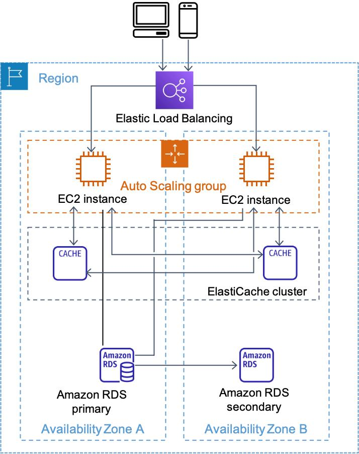

# AWS DevOps CI/CD Practice Project

## Overview

This is a personal hands-on project built to practice and combine my knowledge of AWS, Docker, Terraform, and CI/CD in an end-to-end deployment workflow.

The project focuses on building a highly available containerized application on AWS and automating infrastructure provisioning and application deployment.

The architecture is still being improved as I continue learning and applying DevOps best practices.

## Architecture



### Application Stack

- FastAPI web application
- Celery worker for background tasks
- PostgreSQL on Amazon RDS
- Redis on Amazon ElastiCache
- Docker / Docker Compose

### AWS Infrastructure

- **VPC** with public and private subnets
- **Application Load Balancer** for distributing traffic
- **2 EC2 instances** running the application
- **Amazon RDS** for PostgreSQL
- **Amazon ElastiCache** for Redis
- **Amazon ECR** for Docker image storage
- **NAT Gateway** for outbound access from private EC2 instances
- **AWS Systems Manager (SSM)** for deployment without SSH

Infrastructure is provisioned using **Terraform**.

## CI/CD Pipeline

The pipeline is implemented with GitHub Actions.

```text
Push to master
      ↓
Build Docker Image
      ↓
Run Integration Tests
      ↓
Push Image to ECR
Tag: Git Commit SHA
      ↓
Deploy EC2 #1 via SSM
      ↓
Health Check
      ↓
Deploy EC2 #2 via SSM
      ↓
Health Check
```

GitHub Actions authenticates with AWS using **OIDC and IAM roles**, so long-lived AWS access keys are not stored in GitHub.

Docker images are tagged with the Git commit SHA to provide traceability between source code and deployed versions.

## Infrastructure as Code

Terraform is used to provision the main AWS resources, including:

- VPC with public and private subnets
- EC2 instances
- Application Load Balancer and Target Group
- Security Groups
- NAT Gateway
- RDS PostgreSQL
- ElastiCache Redis

This allows the lab infrastructure to be recreated and destroyed consistently instead of being configured manually through the AWS Console.

## Current Limitations & Future Improvements

This project is primarily a learning environment and is not intended to represent a complete production architecture.

Planned improvements include:

- Replace fixed EC2 instances with **Launch Templates and Auto Scaling Groups**.
- Improve the deployment process by checking **ALB target health** before updating the next instance.
- Implement **automatic rollback** when a deployment fails.
- Move application secrets and database credentials to **AWS Secrets Manager or SSM Parameter Store**.
- Improve Terraform structure by introducing **modules and remote state**.
- Add HTTPS using **an ALB HTTPS listener**.
- Automate configuration EC2 instances with **user data scripts** or **Ansible**.


## What I Learned

Through this project, I practiced:

- Designing AWS networking and application architecture
- Infrastructure as Code with Terraform
- Docker image build and deployment workflows
- CI/CD automation with GitHub Actions
- GitHub OIDC authentication with AWS IAM
- Deploying applications to private EC2 instances through SSM
- Using health checks and rolling deployment concepts
- Troubleshooting AWS networking, IAM, ECR, and deployment issues

## Status

🚧 **Work in Progress**

The core infrastructure and CI/CD workflow are functional. I am continuing to improve the project as I learn more about production-ready DevOps practices.

